<p align="center">
  <picture>
    <source media="(prefers-color-scheme: dark)" srcset="docs/brand/logo-dark.svg">
    
  </picture>
</p>

<h3 align="center">Check what your evidence actually supports.</h3>

<p align="center">
  Enter a claim, attach the documents behind it, and get a verdict that explains itself<br>
  and points back to the exact page and passage it came from.
</p>

<p align="center">
  
  
  
  
  
  
  
  <a href="LICENSE"></a>
</p>

<p align="center">
  <a href="#how-it-works"> How it works</a>
  &nbsp;·&nbsp;
  <a href="#a-real-example"> A real example</a>
  &nbsp;·&nbsp;
  <a href="#quick-start"> Quick start</a>
  &nbsp;·&nbsp;
  <a href="#ai-providers"> AI providers</a>
  &nbsp;·&nbsp;
  <a href="#security"> Security</a>
</p>

<p align="center">
  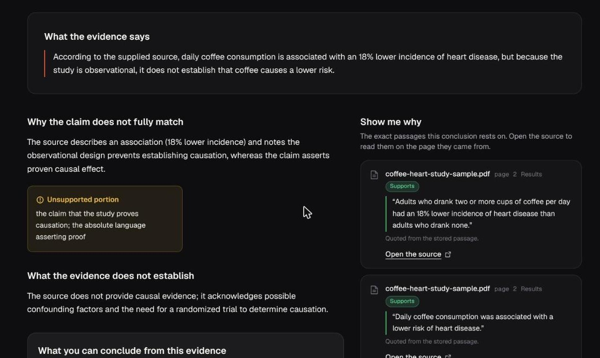
</p>

---

##  What ProofLens does

ProofLens answers one question: **does the evidence I supplied support the claim I am making?**

A source can be real and still not say what a claim says. A study finds an *association* and the claim says it *proves causation*. A report says 1,200 participants and the claim says 10,000. A sentence says something is *not* established and gets quoted as if it were. ProofLens catches that gap, explains it in plain language, and shows the sentence it rests on.

It is **not** a chatbot, a web search, or a universal truth detector. It reasons only over the evidence you attach, and every verdict is a statement about that evidence, not about the world.

<table>
  <tr>
    <td width="33%" valign="top">
      <br>
      <b>The backend owns the verdict</b><br>
      Neither client contains verification logic or calls an AI provider.
    </td>
    <td width="33%" valign="top">
      <br>
      <b>The document stays the authority</b><br>
      Every cited passage links back to its document and page so a person can check it.
    </td>
    <td width="33%" valign="top">
      <br>
      <b>Nothing is faked</b><br>
      If reasoning is unavailable the user sees that, with a retry. Never an invented verdict.
    </td>
  </tr>
</table>

---

##  How it works

<p align="center">
  <picture>
    <source media="(prefers-color-scheme: dark)" srcset="docs/readme/how-it-works-dark.svg">
    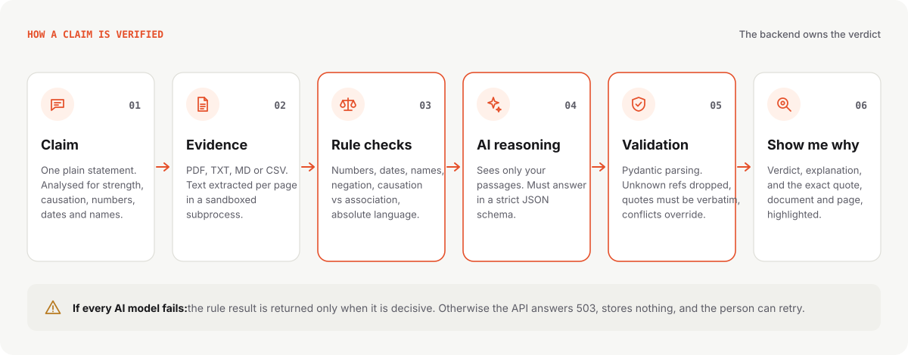
  </picture>
</p>

<table>
  <tr>
    <td width="52%" valign="top">
      <h4> 1. Write the claim</h4>
      One plain statement, up to 10,000 characters. The backend analyses it: how strongly it is worded, whether it asserts causation, and which numbers, dates and names it contains.
      <h4> 2. Attach the evidence</h4>
      Upload a PDF, TXT, MD or CSV file (up to 50 MB), paste a passage, or reuse a document from your library. PDF text is extracted <b>page by page</b> in a sandboxed subprocess with a time and memory limit. You choose the page and trim the text to the passage that matters.
    </td>
    <td width="48%" valign="top">
      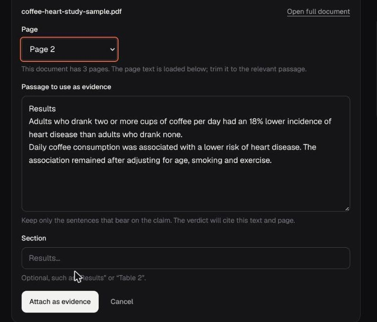
    </td>
  </tr>
  <tr>
    <td valign="top">
      <h4> 3. Rule checks run first</h4>
      Deterministic comparisons against the best-matching passage, with no model involved: <b>numbers, dates, names, negation, causation versus association, absolute and hedged language</b>. Each check becomes a finding the user can read.
      <h4> 4. AI reasons over your passages only</h4>
      The model receives the claim, the rule findings and your passages, each wrapped as untrusted data. It must answer in a <b>strict JSON schema</b>: verdict, confidence, what the source says, why the claim does or does not match, what the source does not establish, what you can conclude, and the passages it relied on.
    </td>
    <td valign="top">
      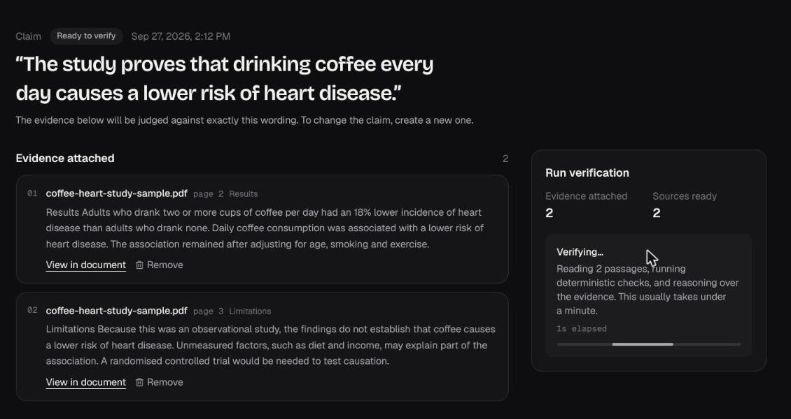
    </td>
  </tr>
  <tr>
    <td valign="top">
      <h4> 5. The backend validates and decides</h4>
      The answer is parsed with Pydantic. References to passages that were never supplied are dropped. A quote must appear verbatim in the stored passage, otherwise it is cleared. Document and page always come from the database, never from the model. A number, date or name conflict overrides a model that says "supported", and a causation gap caps it at "partially supported".
      <h4> 6. Show me why</h4>
      Every cited passage shows its document, page, section and role (<i>Supports</i>, <i>Conflicts</i> or <i>Context</i>). <b>Open the source</b> jumps to that page with the sentence highlighted.
    </td>
    <td valign="top">
      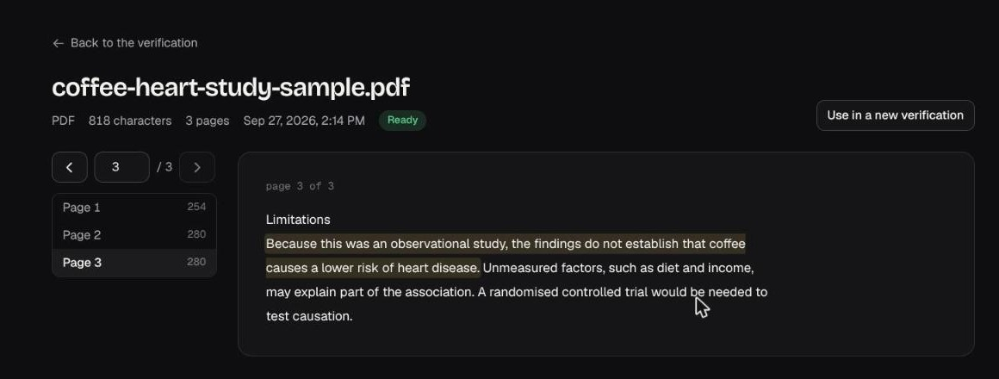
    </td>
  </tr>
</table>

Each verification stores a snapshot of the evidence it used, so a past result never needs the AI again to be displayed, and evidence a stored result depends on cannot be deleted.

---

##  A real example

<p align="center">
  <picture>
    <source media="(prefers-color-scheme: dark)" srcset="docs/readme/example-dark.svg">
    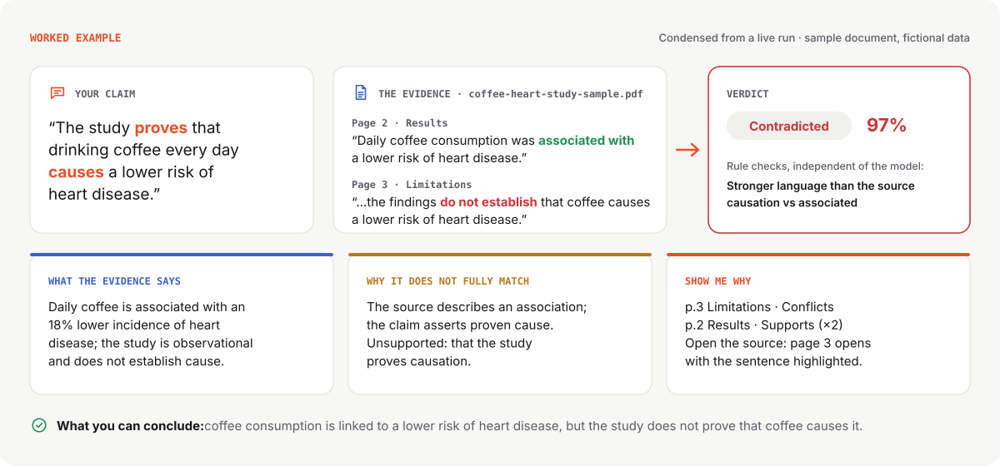
  </picture>
</p>

This is a live run of the web app against [`docs/pitch/coffee-heart-study-sample.pdf`](docs/pitch/coffee-heart-study-sample.pdf), a three-page sample document written for the demo and labelled as fictional data. A plain label would only say *contradicted*. ProofLens explains the gap between the claim and the evidence: the source reports an association, and the claim says the study proves causation. It also says what you *can* honestly conclude.

<p align="center">
  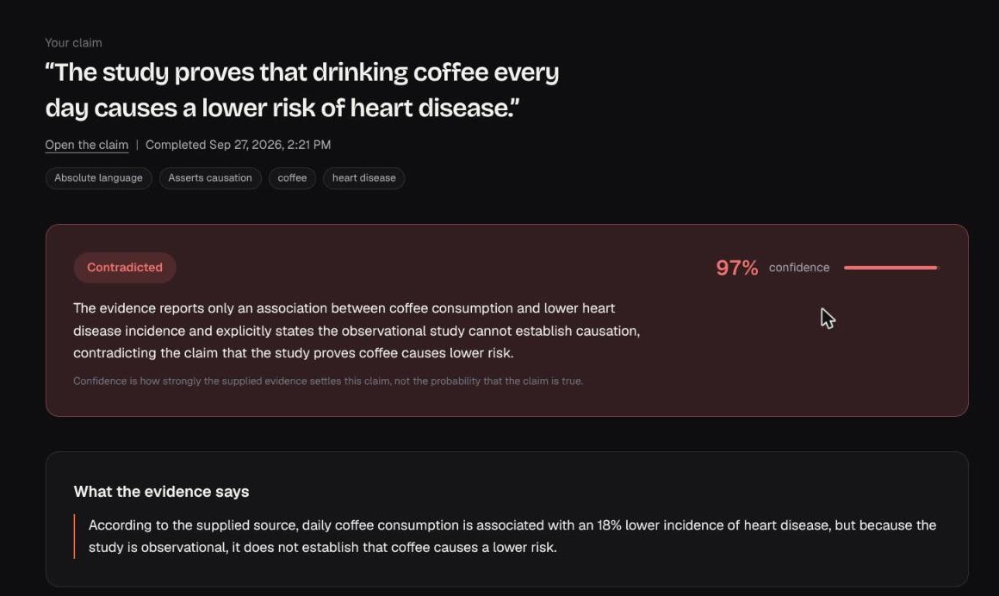
  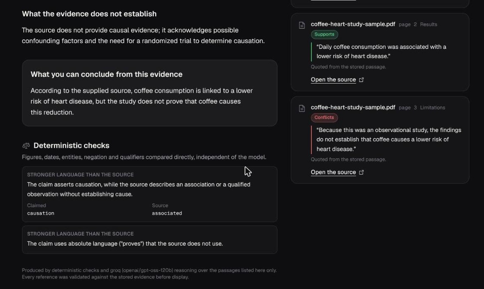
</p>

> Confidence is how strongly the supplied evidence settles the claim, not the probability that the claim is true. The app says this on every result.

---

##  The four verdicts

<p align="center">
  <picture>
    <source media="(prefers-color-scheme: dark)" srcset="docs/readme/verdicts-dark.svg">
    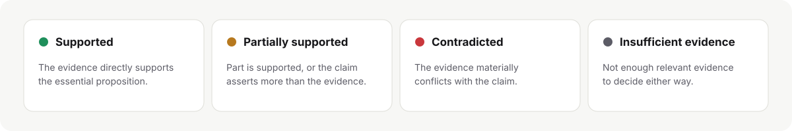
  </picture>
</p>

There is no verdict called "true". *Insufficient evidence* is its own outcome, so "the source does not cover this" is never confused with "the source says the opposite".

---

##  The product

<table>
  <tr>
    <td width="50%">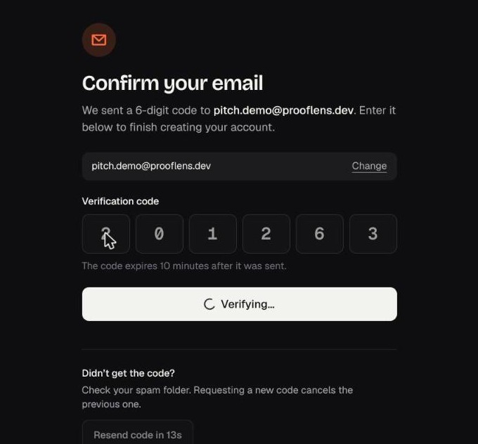</td>
    <td width="50%">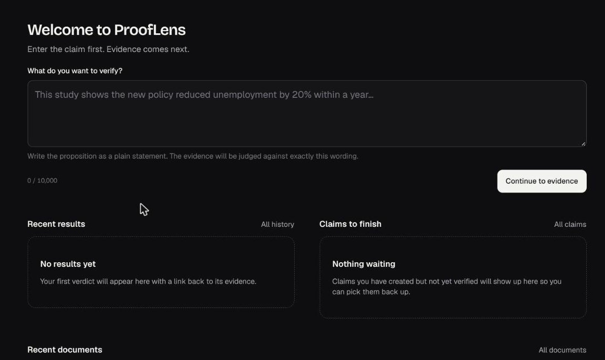</td>
  </tr>
  <tr>
    <td><b>Sign up with a 6-digit email code.</b> Codes are hashed, expire in 10 minutes and allow 5 attempts.</td>
    <td><b>Start from the dashboard.</b> Write the claim first; evidence comes next.</td>
  </tr>
  <tr>
    <td>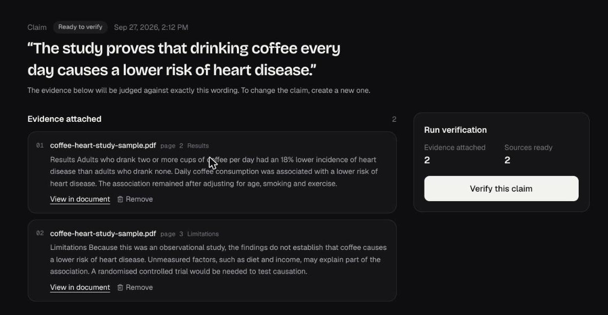</td>
    <td>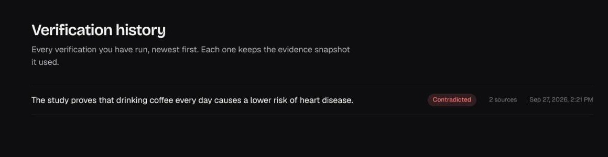</td>
  </tr>
  <tr>
    <td><b>Attach evidence by page.</b> Each passage keeps its document, page and section.</td>
    <td><b>Come back later.</b> History lists every verdict with the number of sources it used.</td>
  </tr>
</table>

| | Area | Route | What it does |
| --- | --- | --- | --- |
|  | Marketing | `/`, `/how-it-works`, `/verdicts`, `/show-me-why` | Product story. The hero card and the verdict examples on these pages are illustrative, not engine output. |
|  | Auth | `/register`, `/verify-email`, `/login` | Register, then enter the 6-digit code from email, then log in. |
|  | Dashboard | `/app` | Claim composer, verifying now, recent results, claims to finish, recent documents. |
|  | Claim workspace | `/app/claims/[id]` | Upload with real progress, passage picker, paste, library, verify panel. |
|  | Result | `/app/verifications/[id]` | Claim analysis, verdict, what the evidence says, why, what it does not establish, conclusion, rule checks, Show me why. |
|  | Document viewer | `/app/documents/[id]` | Page navigation and highlighting from `?page=&q=`, with a link back to the result. |
|  | Lists and account | `/app/claims`, `/app/documents`, `/app/history`, `/app/account` | Paginated lists; theme, log out, and sign out everywhere. |
|  | Mobile (Expo) | `apps/mobile` | Same flow behind a three-slide introduction: tabs for Home, Activity, Library and More; file picker; result with Show me why. Light and dark themes. Checked in a browser at phone size, not yet captured on a device. |

<p align="center">
  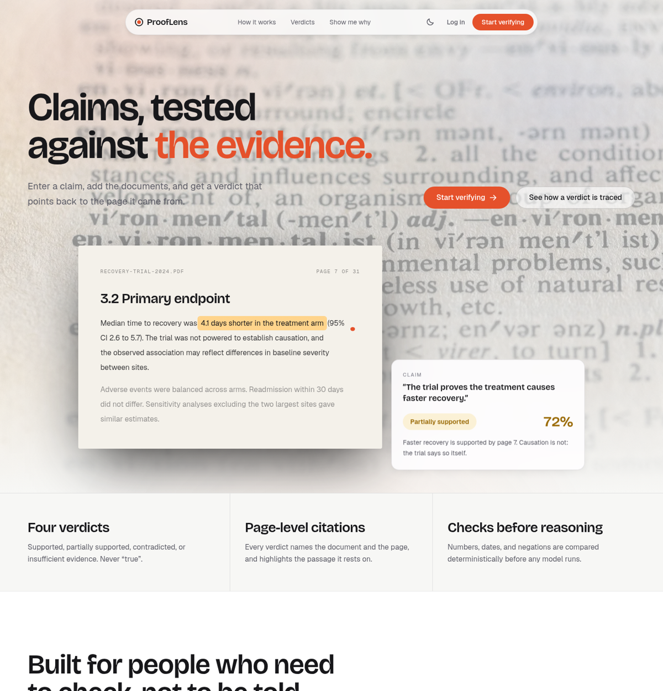
  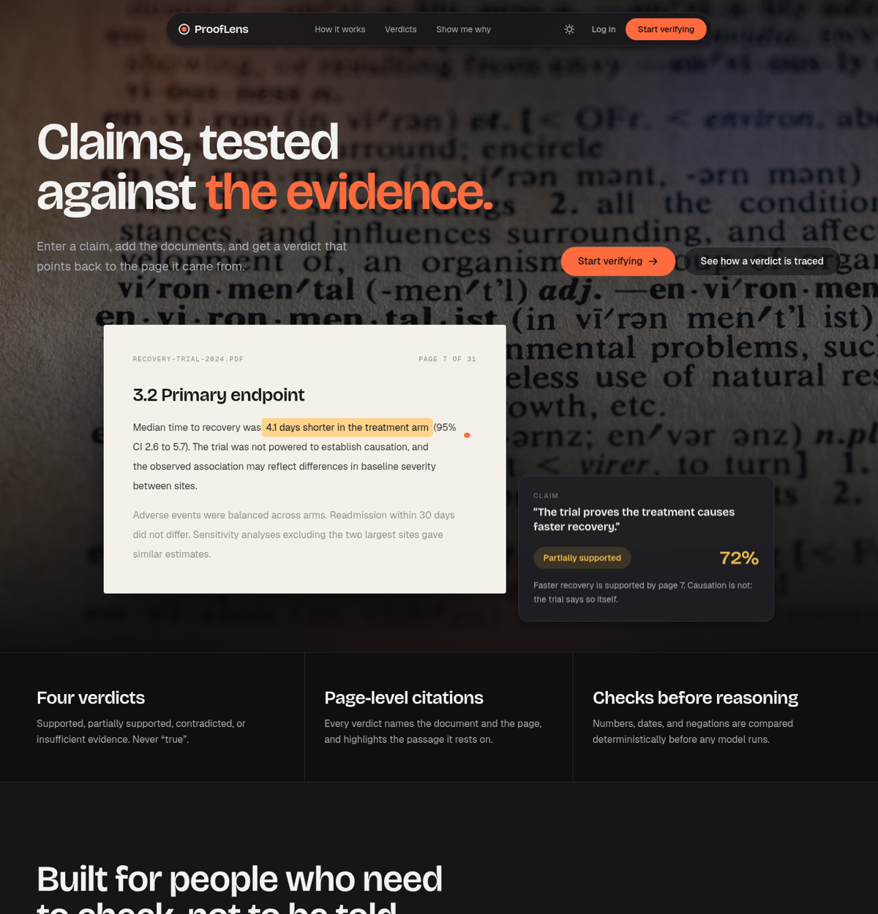
</p>

---

##  Architecture

<p align="center">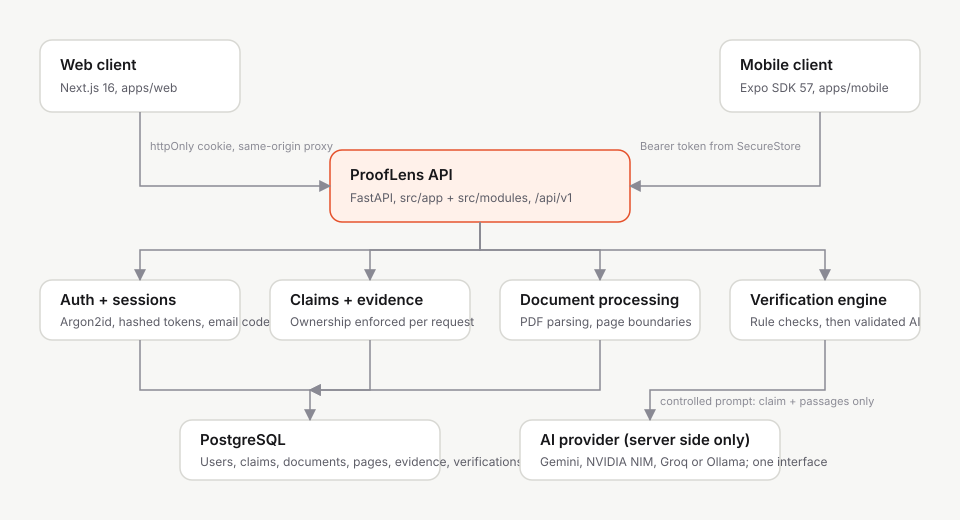</p>

| Layer | Location | Responsibility |
| --- | --- | --- |
| Web client | `apps/web` | Next.js 16 App Router. Server components for reads and server actions for writes; the token lives in an httpOnly cookie, and browser calls go through a same-origin proxy. |
| Mobile client | `apps/mobile` | Expo SDK 57 and expo-router. The token lives in SecureStore. |
| API | `src/app`, `src/modules/*/presentation` | FastAPI routers under `/api/v1`, error normalisation, CORS, body-size limits, security headers. |
| Application | `src/modules/*/application` | Commands and queries: create claim, process document, extract evidence, verify claim. |
| Domain | `src/modules/*/domain` | `Claim`, `Document`, `DocumentPage`, `Evidence`, `SourceReference`, `Verification`, `Verdict`, `Confidence`. |
| Infrastructure | `src/modules/*/infrastructure`, `src/shared/infrastructure` | PostgreSQL repositories (async SQLAlchemy 2, Alembic), PyMuPDF worker, rule and LLM engines, AI providers, auth, rate limiting, email. |

---

##  AI providers

One `InferenceProvider` interface with four adapters. Which one runs is configuration only. Each request is answered by a single provider; fallback models are tried in order, not combined.

| Provider | Adapter | Structured output | Checked live on 27 Sep 2026 |
| --- | --- | --- | --- |
|  Groq | OpenAI-compatible | `response_format: json_schema` (strict) | `openai/gpt-oss-120b` |
|  Google Gemini | google-genai SDK | Native response schema | `gemini-3.5-flash`, `gemini-3.8-flash` |
|  NVIDIA NIM | OpenAI-compatible | `response_format: json_schema` (strict) | `nvidia/nemotron-3-super-120b-a12b`, `nvidia/nemotron-3-ultra-550b-a55b` |
|  Ollama | Local `/api/chat` | `format` = schema | Not run |

Check your keys and models against real verification requests:

```bash
cd src
.venv/bin/python -m scripts.check_ai                                   # configured model + fallbacks
.venv/bin/python -m scripts.check_ai z-ai/glm-5.3 openai/gpt-oss-20b   # specific models, same provider
```

The script prints only model names and outcomes, never keys.

---

##  Quick start

Prerequisites: Node.js 24, Python 3.11 or newer, and PostgreSQL 15 or newer.

```bash
git clone <this repository> ProofLens && cd ProofLens

# 1. Install root tooling, web, mobile, and the Python virtualenv
npm run install:all

# 2. Configure the backend
cp src/.env.example src/.env
#    set PROOFLENS_DATABASE_URL
#    add at least one AI key: PROOFLENS_GROQ_API_KEY, PROOFLENS_GEMINI_API_KEY or PROOFLENS_NVIDIA_API_KEY
#    (with no key, the rule-based engine runs alone)

# 3. Configure the web client
cp apps/web/.env.example apps/web/.env.local

# 4. Create the schema
cd src && .venv/bin/python -m alembic upgrade head && cd ..

# 5. Run backend + web + mobile
npm run dev
```

Open `http://localhost:3000`. With `PROOFLENS_EMAIL_BACKEND=console` (the development default), the 6-digit sign-up code is printed in the backend log. The Expo dev server prints a QR code for the mobile app. API docs are at `http://localhost:8000/docs` while `PROOFLENS_DEBUG=true`.

| Command | Starts | Backend binds to |
| --- | --- | --- |
| `npm run dev` | backend + web + mobile | `0.0.0.0:8000`, so a phone on the same network can reach it |
| `npm run dev:web` | backend + web | `127.0.0.1:8000` |
| `npm run dev:mobile` | backend + mobile | `0.0.0.0:8000` |

Single processes: `npm run backend`, `npm run backend:lan`, `npm run web`, `npm run mobile`. If port 3000 is taken, run `npx next dev -p 3100` in `apps/web`.

---

##  Configuration

All backend settings live in `src/.env` and are prefixed `PROOFLENS_`.

| Setting | Default | Purpose |
| --- | --- | --- |
| `DATABASE_URL` | `postgresql+asyncpg://...` | PostgreSQL connection string. |
| `AI_PROVIDER` | empty | `gemini`, `nvidia`, `groq`, `ollama` or `none`. Empty picks the first with a key, in the order Gemini, NVIDIA, Groq. |
| `AI_MODEL` | empty | Overrides the provider's model. |
| `GROQ_API_KEY`, `GROQ_MODEL`, `GROQ_FALLBACK_MODELS` | empty, `llama-3.3-70b-versatile`, empty | Groq. |
| `GEMINI_API_KEY`, `GEMINI_MODEL`, `GEMINI_FALLBACK_MODELS` | empty, `gemini-3.8-flash`, empty | Google Gemini. |
| `NVIDIA_API_KEY`, `NVIDIA_MODEL`, `NVIDIA_FALLBACK_MODELS` | empty, `nvidia/nemotron-3-super-120b-a12b`, empty | NVIDIA NIM (`build.nvidia.com`). |
| `OLLAMA_BASE_URL`, `OLLAMA_MODEL` | `http://localhost:11434`, `llama3.1` | Local provider; no key needed. |
| `*_FALLBACK_MODELS` | empty | Comma-separated models tried in order when the main one errors, times out or keeps returning invalid output. |
| `AI_TIMEOUT_SECONDS`, `AI_MAX_OUTPUT_TOKENS`, `AI_REASONING_EFFORT` | `30`, `2000`, empty | Call limits and optional reasoning depth (`low`, `medium`, `high`). |
| `EMAIL_BACKEND` | `console` | `console` (development only), `resend` or `smtp`. |
| `OTP_LENGTH`, `OTP_EXPIRY_MINUTES`, `OTP_MAX_ATTEMPTS`, `OTP_RESEND_COOLDOWN_SECONDS` | `6`, `10`, `5`, `60` | Sign-up code policy. |
| `AUTH_TOKEN_EXPIRY_HOURS`, `AUTH_MAX_SESSIONS` | `24`, `5` | Session lifetime and concurrent session cap. |
| `CORS_ORIGINS` | `localhost:3000`, `localhost:8081` | Allowed browser origins. |

Web (`apps/web/.env.local`): `PROOFLENS_API_URL` is used server-side only; `PROOFLENS_SECURE_COOKIES=true` should be set behind HTTPS. Mobile (`apps/mobile/.env`): `EXPO_PUBLIC_API_URL` optionally overrides the API host that is otherwise derived from the Expo dev server.

---

##  API

All routes live under `/api/v1`. Everything except `/health`, `/auth/register`, `/auth/verify-otp`, `/auth/resend-verification` and `/auth/login` requires `Authorization: Bearer <token>`.

| Area | Routes |
| --- | --- |
| Auth | `POST /auth/register`, `POST /auth/verify-otp`, `POST /auth/resend-verification`, `POST /auth/login`, `GET /auth/me`, `POST /auth/logout`, `POST /auth/revoke-all` |
| Claims | `POST /claims/`, `GET /claims/`, `GET /claims/{id}` |
| Documents | `POST /documents/` (text), `POST /documents/upload` (file), `GET /documents/`, `GET /documents/{id}`, `GET /documents/{id}/pages` |
| Evidence | `POST /evidence/`, `GET /evidence/?claim_id=`, `GET /evidence/{id}`, `DELETE /evidence/{id}` |
| Verification | `POST /verification/`, `GET /verification/` (history, optional `claim_id`), `GET /verification/{id}` |

A verification response carries:

- `verdict`, `confidence` and `reasoning`;
- the explanation fields `source_grounded_statement`, `why_claim_does_not_match`, `supported_parts`, `unsupported_parts`, `source_limitations` and `conclusion`;
- `claim_analysis` and the deterministic `findings`;
- validated `evidence_references` (evidence, document, page, verbatim quote, role);
- `analysis` (mode, provider, model) and the evidence snapshot.

Status codes: 401 expired session, 404 not found or not yours, 409 conflict (a verification already running, or evidence in use), 413 too large, 422 validation, 429 rate limited, 503 reasoning unavailable.

---

##  Security

| | Control |
| --- | --- |
|  | **Passwords** use Argon2id. Legacy PBKDF2 hashes are upgraded at login. Unknown emails take the same time as known ones. |
|  | **Sessions** are random tokens stored only as SHA-256 hashes, expire after 24 h, can be revoked (log out, sign out everywhere), and are capped at 5 per user. |
|  | **Sign-up codes** come from `secrets`, are stored as Argon2 hashes, are single use, expire in 10 minutes and allow 5 attempts. Registration never reveals whether an email exists. |
|  | **Rate limits**, stored in PostgreSQL and failing closed: failed logins per email+IP and per IP, registrations per IP, failed codes, resend cooldown, and emails per address. |
|  | **Ownership** is checked on every claim, document, evidence and verification query. Another user's resource is a 404. |
|  | **Uploads**: body caps of 1 MB, or 50 MB on documents (streamed bodies counted); PDFs parsed in an isolated subprocess with a timeout and memory limit. |
|  | **The model cannot invent evidence**: references are validated against stored passages, and document text is treated as untrusted data so it cannot reach the instructions. |
|  | **Clients hold no secrets.** The web token is in an httpOnly cookie behind a same-origin proxy; the mobile token is in SecureStore. AI and email keys exist only in `src/.env`. |

Security headers are always sent (nosniff, frame deny, referrer and permissions policy, COOP). HSTS and CSP are added in production.

To report a vulnerability, see [`SECURITY.md`](SECURITY.md). Please use GitHub's private reporting, not a public issue.

---

##  Testing

Run on 27 Sep 2026 against PostgreSQL 17: **297 passed, 0 failed**. ruff and mypy are clean.

| Suite | Tests | Covers |
| --- | --- | --- |
| Unit | 186 | LLM engine, provenance, retries and model fallback (27); rule checks (18); document processing (18); providers (15); OTP; repositories |
| Integration (real DB) | 111 | Security (47): cross-user access, revocation, session cap, rate limits, body limits, locks. Email codes (22). Upload (16). Source grounding with provider outage and prompt injection (9). Full API flow (9). Migrations. |

```bash
# Backend (needs PROOFLENS_TEST_DATABASE_URL pointing at a throwaway database)
cd src && .venv/bin/python -m pytest -q && .venv/bin/ruff check . && .venv/bin/mypy app shared modules

# Web and mobile type-check and build
cd apps/web && npx tsc --noEmit && npm run build
cd apps/mobile && npx tsc --noEmit && npx jest
```

The screenshots in this README come from a manual end-to-end run in the browser against the real backend: register, email code, claim, PDF upload, passage selection, verify, Show me why, and history.

---

##  Known limits

- **Frontend and e2e:** there are no web frontend or end-to-end tests yet (`tests/e2e/` is empty). The mobile app has unit tests for its logic (formatting, error mapping, passage matching, data loading) but none for its screens. In `apps/web`, `npm run lint` is blocked upstream because typescript-eslint does not support TypeScript 7; type-checking and builds pass.
- **Mobile:** the app has been checked in a browser at phone size in both themes, but not yet captured on a device.
- **Evidence placement:** the passage and page of a piece of evidence are chosen by the client and are not yet checked against the stored page text.
- **Negation:** a negation conflict caps the AI's confidence but does not flip an AI "supported" verdict.
- **Rate limiting:** `/verification/` and uploads are not rate limited.
- **Docker dependencies:** `google-genai` and `resend` are used but not declared in `pyproject.toml`, so add them before building the Docker image with Gemini or Resend.
- **Viewer:** the document viewer highlights extracted text, not the original PDF layout.
- **Accuracy:** no accuracy benchmark exists yet.

---

##  Pitch materials

The GOMYCODE Nigeria "Come Build with AI" 2026 materials are in [`docs/pitch/`](docs/pitch/):

- [`PITCH_PREP.md`](docs/pitch/PITCH_PREP.md): verified inventory, demo script, the 90-second version, and a fact table;
- the 10-slide deck (`ProofLens-pitch.pptx` and its generator);
- the raw screenshots;
- the sample PDF.

The README illustrations and icons are generated by [`docs/readme/generate.py`](docs/readme/generate.py).

---

## Licence and credits

 Released under the [MIT License](LICENSE).  Security policy: [`SECURITY.md`](SECURITY.md).

Built by [Oluwayemi Oyinlola](http://portfolio.oyinlola.site/).
